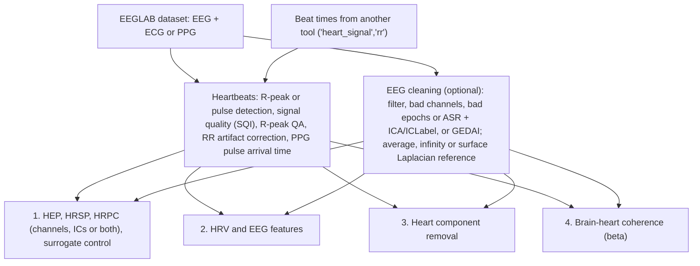

<!-- <p align="center"> -->
# BrainBeats
<!-- </p> -->

<p align="center" width="100%">
  
</p>


BrainBeats is an EEGLAB plugin to process and analyze EEG together with a cardiovascular signal (ECG or PPG) recorded at the same time, for brain-heart interplay research. It runs from its own entry in the EEGLAB menu bar or from the command line, and provides:

1. **Heartbeat-evoked potentials (HEP)**, heartbeat-related spectral perturbations (HRSP) and heartbeat-related phase consistency (HRPC), on scalp channels, independent components or both, with a surrogate heartbeat control
2. **EEG and HRV features** in the time, frequency and nonlinear domains
3. **Removal of heart components** from the EEG (ICA and ICLabel): part of the HEP analysis, or on its own from the command line
4. **Brain-heart coherence** (beta)

The figures below come from the sample dataset in `sample_data` (64-channel EEG, ECG and PPG, 3.8 min of eyes-open rest; sub-032 of [ds003838](https://nemar.org/dataexplorer/detail?dataset_id=ds003838)). They are regenerated by `tests/make_readme_figures.m`.


## Installation

- MATLAB with the Signal Processing and the Statistics and Machine Learning toolboxes (Parallel Computing is optional, for 'parpool').
- [EEGLAB](https://github.com/sccn/eeglab) with the clean_rawdata, ICLabel and firfilt plugins (included by default). PICARD (fast ICA), REST (infinity reference) and GEDAI (artifact removal) are installed automatically when these options are selected.
- In EEGLAB: File > Manage extensions, search for BrainBeats, and install it. Or clone this repository into `eeglab/plugins`.
- Your data: one EEGLAB dataset with the EEG and heart channels recorded together.


## Quick start

Click **BrainBeats** in the EEGLAB menu bar. The window shows the current dataset (or loads one, or the sample dataset), and selects the analysis, the heart signal and channel(s), and, for HEP, whether the analysis is performed on the scalp channels, the independent components or both. **Next** opens the parameters of the analysis.

<p align="center" width="100%">
  
</p>

From the command line:

```matlab
eeglab; close
EEG = pop_loadset('filename','dataset.set','filepath', fullfile(fileparts(which('brainbeats_process')),'sample_data'));

% Window
[EEG, com] = pop_brainbeats(EEG);

% Command line: HEP from the ECG channel, with EEG cleaning and 100 surrogate heartbeat trains
EEG = brainbeats_process(EEG, 'analysis','hep', 'heart_signal','ecg', ...
    'heart_channels',{'ECG'}, 'clean_eeg',true, 'hep_surrogates',100);
```

`brainbeats_tutorial.m` walks through every method with the sample data, and `help brainbeats_process` lists all options. Outputs are stored in `EEG.brainbeats` (parameters, heartbeats, signal quality, features, ROI or IC results, HRSP, surrogate results), and the command reproducing a GUI run is in the EEGLAB history (`eegh`).


## Overview




## Heartbeat detection

All methods start from the heartbeats: R-peaks for ECG, pulse onsets ('valleys', default) or peaks for PPG, or beat times detected with another tool ('heart_signal','rr' with 'beat_latencies' in s). BrainBeats computes a signal quality index (SQI), flags ECG beats detected on the wrong wave (e.g. the T-wave), and corrects RR artifacts: a false beat is removed and its interval merged with the next one, and missing beats are inserted in gaps. With several heart channels, the one with the fewest abnormal beats is used. PPG pulses are detected relative to the local pulse amplitude, so pulses are kept where the amplitude drops.

<p align="center" width="100%">
  
</p>
<p align="center"><em>ECG signal with the detected R-peaks, and the RR intervals before and after artifact correction (NN intervals).</em></p>


## EEG preprocessing

With 'clean_eeg' (on by default in the GUI):

- FIR filters: 0.5-30 Hz for HEP (the slow HEP components are kept; ICA is fitted on a 1-Hz high-passed copy), 1-40 Hz otherwise; line noise notch; zero-phase or causal.
- Bad channels removed (clean_rawdata) and interpolated.
- Artifact removal ('clean_method'): bad epochs (HEP) or ASR (continuous data), then ICA and ICLabel ('asr_ica', default); or GEDAI ('gedai'; Ros et al., 2025), which removes artifacts from the continuous data without ICA (installed from the EEGLAB extension manager if needed; noncommercial license).
- Reference ('ref'): average (default), infinity (REST), surface Laplacian ('csd', current source density with spherical splines; applied after the artifact removal, since ICLabel needs average-referenced data; channels must have 10-05 labels), or none.


## 1. Heartbeat-evoked potentials (HEP)

- EEG epochs from -300 to 600 ms around each heartbeat ('hep_window'), time-locked to the heartbeats kept after RR correction. Heartbeats followed by the next one before the end of the epoch + 50 ms are rejected, so no epoch contains the next QRS, as are outlier inter-beat intervals. 'hep_window','adaptive' sets the epoch end from the subject's heart rate (within-subject analyses only).
- No baseline correction by default: the pre-R-peak window holds activity of the previous cardiac cycle, and the recent methods review of Steinfath et al. (2026) recommends reporting HEPs without baseline correction and testing the baseline window. Optional regression-based baseline correction ('hep_baseline','regression'; Alday, 2019; window [-150 -50] ms, which ends before the QRS onset): the baseline is a trial-level regressor instead of being subtracted.
- HRSP and HRPC (pairwise phase consistency across heartbeats) from 4 to 30 Hz, with 5-cycle Morlet wavelets applied to the continuous data. HRSP is expressed relative to the whole cardiac cycle. HRPC is the pairwise phase consistency across heartbeats (Vinck et al., 2010), unbiased by the number of heartbeats.
- Where ('hep_level'): on all channels ('channels', default; plots of the average of a channel ROI, 'hep_roi', default frontocentral: F1-F4, Fz, FC1-FC4, FCz, C1-C4, Cz), on the independent components ('ics'), or both ('both'). The three measures and the surrogate control are computed the same way in both cases.
- Independent components: the HEP, HRSP, HRPC and surrogate control of every IC (of the cleaning ICA, or of an ICA run for this), exported with their scalp maps and ICLabel classes. BrainBeats does not select ICs: whether a heartbeat-locked brain response can be separated from the cardiac field artifact is not established, and on the sample data the most heartbeat-locked ICs also followed the ECG's QRS or T-wave.
- Surrogate heartbeat control ('hep_surrogates', e.g. 100): surrogate heartbeat trains built from the shuffled inter-beat intervals, so their beats fall at random cardiac phases. The HEP, HRSP and HRPC at each latency are compared with the surrogates (FDR-corrected). The cardiac field artifact is heartbeat-locked too: the control shows heartbeat locking, not a neural origin. 'hep_surrogate_mode','rigid' shifts the whole train instead (Park et al., 2018), for contrasts between conditions.
- PPG: the pulse reaches the sensor ~200-450 ms after the heartbeat, so the PPG beats are shifted back by the pulse arrival time ('ppg_transit','auto'): measured from an ECG channel when the file has one; otherwise from the cardiac field artifact of the EEG, which precedes each pulse by that delay (420 ms on the sample data, 424 ms with its ECG); otherwise the literature value (250 ms to the pulse onset at the finger; Mukkamala et al., 2015; Kortekaas et al., 2018). A delay in ms can also be given.

Residual cardiac field artifact can remain after ICA (method 3 below), in particular in the first ~100 ms after the R-peak: check it before interpreting early HEP effects.

<p align="center" width="100%">
  
</p>
<p align="center"><em>HEP from the ECG (cleaned EEG): all electrodes with scalp maps at selected latencies (top), and single heartbeats of the frontocentral ROI (bottom).</em></p>

<p align="center" width="100%">
  
</p>
<p align="center"><em>Frontocentral ROI: HEP against 100 surrogate heartbeat trains (gray: 95% of the surrogates; red: FDR-corrected p < .05), HRSP (dB relative to the cardiac cycle) and HRPC, with the FDR contours. Dashed white lines: ±2 SD of the wavelets around the R-peak, where the time-frequency values include the QRS.</em></p>

<p align="center" width="100%">
  
</p>
<p align="center"><em>HEP from the PPG alone, with the beats shifted back by the pulse arrival time estimated from the EEG cardiac field artifact.</em></p>


## 2. EEG and HRV features

From the continuous data:

- HRV time domain: SDNN, RMSSD, pNN50
- HRV frequency domain: ULF, VLF, LF and HF power, LF/HF ratio, total power (normalized Lomb-Scargle periodogram by default; 'LombScargle', 'welch' or 'fft' give ms²)
- HRV nonlinear domain: Poincaré (SD1, SD2, SD1/SD2), fuzzy entropy, fractal dimension, PRSA acceleration and deceleration capacities (Bauer et al., 2006)
- EEG time domain: RMS, variance, skewness, kurtosis, IQR
- EEG frequency domain: band power (delta, theta, alpha, beta, gamma; optionally individualized from the alpha peak), individual alpha frequency (IAF), alpha asymmetry (each left electrode paired with its mirror position), relative power and band ratios
- EEG nonlinear domain: fuzzy entropy, fractal dimension

<p align="center" width="100%">
  
</p>
<p align="center"><em>Power spectral density of the HRV (normalized) and of the EEG (dB), with the frequency bands used.</em></p>

<p align="center" width="100%">
  
</p>
<p align="center"><em>EEG features on the scalp: band power, IAF, fuzzy entropy, fractal dimension and alpha asymmetry.</em></p>


## 3. Heart component removal

In the HEP analysis, the cardiac field artifact is removed during the EEG cleaning ('heart_removal'), in one of two ways:

- 'ica' (default): the heart components found by ICLabel are removed with the other artifact components ('conf_thresh': minimum ICLabel heart probability, default 0.75).
- 'ecg_regression' (needs an ECG, no ICA): the ECG, filtered like the EEG and shifted by -20 to +20 ms, is regressed out of each EEG channel. The fit uses the samples without large EEG artifacts. On the sample data, the heart-locked EEG amplitude (-50 to 100 ms) goes from 2.11 to 0.59 µV (-72%), removing 0.8% of the EEG variance, and in a test 91% of a synthetic 1-µV response added 300 ms after each R-peak was kept. The lags are fixed: longer ones also remove heartbeat-locked brain responses (59% of the synthetic response kept with ±100 ms).

Neither removes the artifact completely, and both can remove part of a heartbeat-locked brain response. The removal can also be run on its own from the command line ('analysis','rm_heart'; 'conf_thresh' default 0.9): ICA and ICLabel find the heart components of the EEG, which are removed. The heart-locked EEG amplitude (cardiac field artifact) is reported before and after removal. On the sample data, the heart component found removes 40-50% of it (2.1 to 1.1 µV with the tutorial settings): ICA reduces the cardiac field artifact but does not remove it completely.

<p align="center" width="100%">
  
</p>
<p align="center"><em>Heart component found by ICLabel.</em></p>

<p align="center" width="100%">
  
</p>
<p align="center"><em>EEG before (red) and after (blue) removal of the heart component.</em></p>


## 4. Brain-heart coherence (beta)

Coherence, partial coherence, directed coherence and partial directed coherence between each EEG channel and the heart signal, from a multivariate autoregressive model fitted to the data ('analysis','coherence'). This method has not been validated yet: please test it and report problems in the [issues](https://github.com/amisepa/BrainBeats/issues).

<p align="center" width="100%">
  
</p>
<p align="center"><em>The four measures for each EEG channel, 0-40 Hz.</em></p>

<p align="center" width="100%">
  
</p>
<p align="center"><em>Coherence with the ECG per frequency band.</em></p>


## Tutorials

- `brainbeats_tutorial.m` (command line, all methods, sample data)
- JoVE article (v1.4): https://www.jove.com/t/65829/brainbeats-as-an-open-source-eeglab-plugin-to-jointly-analyze-eeg
- JoVE video: https://www.jove.com/v/65829/author-spotlight-advancing-study-brain-heart-interplay-with

The JoVE tutorial describes v1.4: the menu, some defaults and results have changed since (see the version history).


## Version history

v1.6 (9/2026) - Many fixes and a few additions (see below). Results of some features change:
- BrainBeats now has its own entry in the EEGLAB menu bar (was Tools > BrainBeats). It opens a main window (dataset, which can also be loaded there, analysis, heart signal and channels, IC measures for HEP), then the parameters of the analysis. Coherence is available from the GUI, heart artifact removal is an option of the HEP analysis there (by ICA, or by the new ECG regression, 'heart_removal'; the separate 'rm_heart' analysis remains in the command line), unused options were removed (e.g. the PPG 'learning period', which no code used), and the command line of a GUI run in the EEGLAB history now includes every option.
- Heartbeats: improved R-peak detection and correction (get_RR, clean_rr: a removed false beat now merges its interval with the next one; missing beats are inserted in gaps), per-electrode outputs with several heart channels, new R-peak QA report (rpeak_qa: flags beats detected on the wrong wave, e.g. T-wave), ECG artifact detector (detect_ecg_artifacts), PPG 'ppg_detect_mode' ('valleys' or 'peaks'). PPG pulses are detected with a prominence relative to the local pulse amplitude (a global height threshold missed the low-amplitude pulses: 301 instead of 306 beats on the sample data).
- New regression-based baseline correction of HEP epochs ('hep_baseline','regression'; Alday, 2019): the baseline is used as a trial-level regressor instead of being subtracted, and the corrected epochs are stored in the output dataset, ready for further analyses (BASELINE_REGRESSION can also be called directly with condition labels).
- New 'rr' heart signal: provide beat times detected elsewhere ('beat_latencies', in s) for HEP or HRV features.
- EEG preprocessing: new GEDAI artifact removal ('clean_method','gedai'). The infinity reference ('ref','infinity') and the surface Laplacian ('ref','csd') work: both silently fell back to the average reference (REST could not find its files when EEGLAB had not added its subfolders; CSD was missing). The surface Laplacian is applied after the artifact removal. For HEP, the high-pass is now 0.5 Hz by default (was 1 Hz), and ICA is fitted on a 1-Hz high-passed copy of the data.
- HEP: epochs are now -300 to 600 ms by default ('hep_window'; was -300 to 700 ms), and heartbeats followed by the next one before the epoch end + 50 ms are rejected, so no epoch contains the next QRS (with -300 to 700 ms and a 550 ms limit, 28% of the sample-data epochs did). 'hep_window','adaptive' sets the epoch end from the subject's heart rate, for within-subject analyses. The inter-beat-interval rejection now actually removes trials (all events were epoched before), epochs are time-locked to R-peaks only (not to other events in the file), and to the beats kept after RR cleaning.
- HRSP (heartbeat-related spectral perturbations; was 'HEO') and new HRPC (heartbeat-related phase consistency: the pairwise phase consistency across heartbeats, unbiased by their number): zero-phase 5-cycle Morlet wavelets, 4-30 Hz, applied to the continuous data and indexed at the same heartbeats as the HEP epochs; HRSP is expressed relative to the whole cardiac cycle (the pre-R-peak baseline overlapped the QRS once smeared by the wavelets). They are computed for all channels (EEG.brainbeats.hrsp), plotted for the average of a channel ROI (default frontocentral, 'hep_roi'), and computed for all independent components with 'hep_level' 'ics' or 'both'.
- Surrogate heartbeat control ('hep_surrogates', e.g. 100): surrogate heartbeat trains from shuffled inter-beat intervals (or the whole train rigidly shifted by up to +/-500 ms, 'hep_surrogate_mode','rigid'; Park et al., 2018), and the HEP, HRSP and HRPC at each latency are compared with the surrogates (z-scores, FDR-corrected p-values; EEG.brainbeats.surrogate). With EEG cleaning, the continuous data get exactly the same cleaning as the epochs.
- HEP baseline: none by default, as recommended by Steinfath et al. (2026); the regression baseline window is now [-150 -50] ms (was [-300 -100]). With 'keep_heart', the heart channel is added after the EEG cleaning and keeps its units (it went through the ICA and was rescaled).
- PPG: HEPs are time-locked to the heartbeats rather than to the pulses ('ppg_transit', 'auto' by default): the pulse arrival time is measured from an ECG channel of the file (ESTIMATE_PAT), else from the cardiac field artifact of the EEG (ESTIMATE_PAT_EEG), else set to the literature value (250 ms to the pulse onset); a delay in ms can also be given. On the sample data, the arrival time was 424 ms with the ECG and 420 ms from the EEG, and the PPG-based HEP correlated with the ECG-based HEP at r = 0.86 after correction (r = -0.17 before).
- EEG band power: theta, alpha, beta and gamma used wrong frequency edges (bin indices instead of Hz); fixed. The 'individualized' band option works again: alpha is bounded by the individual alpha peak (median across channels), with the theta and beta edges moved accordingly (the band limits used are in frequency.bands). IAF threshold (restingIAF) restored to log10. Alpha asymmetry pairs each left electrode with its mirror position (it could pair C3 with T8), and its 'asy_norm' option now divides alpha by each channel's total power. Entropy features are computed at the actual resampled rate.
- HRV: pNN50 is now in % (was a fraction rounded to one decimal), PRSA acceleration/deceleration capacities follow Bauer et al. (2006) (were the mean NN at the anchors), LF/HF is no longer divided by total power with 'hrv_norm'. Band powers: unitless with the default normalized Lomb-Scargle periodogram (were multiplied by 1e6 and labelled ms^2), in ms^2 with 'LombScargle', 'welch' and 'fft'; the mean NN is removed before Welch/FFT (it inflated LF and HF), the 'fft' method works (it crashed), and recordings shorter than 34 s return NaN band powers instead of crashing.
- ECG/PPG signal quality: windows where the two detectors agree on no beat now count as bad (were ignored); the PPG SQI now covers the whole recording (only the last 30 s were kept), is computed on the filtered PPG, and the bad portion is the beats of unacceptable quality (Li & Clifford, 2012) rather than an SQI below .9, which also flagged normal long beats: 1% instead of 33% on the clean sample PPG.
- Brain-heart coherence: the MVAR model is now fitted to the data before computing the coherence measures (the data were passed as model coefficients).
- rm_heart: heart components are no longer removed before the heart-component step; heart channel removed unless 'keep_heart'; the heart-locked EEG amplitude (cardiac field artifact) is reported before and after removal. The 'boost' option was removed: it did not change the components found and re-referenced the data through the rescaled heart channel.
- Command line: 'icamethod' (or 'ica_method'), 'conf_thresh', and get_RR options are now parsed; 'parpool','off' and 'eeg_features'/'hrv_features','off' work; parallel pool uses the 'Processes' profile and no longer changes your saved parallel settings. Runs under 'matlab -batch' no longer block on dialogs or the progress bar.
- GUI: new HEP options (epoch window, baseline correction, ROI, HRSP/HRPC, surrogate control, and the PPG pulse arrival time); reference and filter-type choices were mapped to the wrong options in some modes (fixed).
- Figures: toolbars hidden and figures drawn right away in recent MATLAB versions (they stayed blank during ICA); the bad-epochs plot shows the rejected epochs with their own events and automatic scaling.

v1.5 (5/2/2024) - METHOD 4 (brain-heart coherence) added

v1.4 (4/1/2024) - publication JoVE (methods 1, 2, 3)

## When using BrainBeats, please cite:

Cannard, C., Wahbeh, H., & Delorme, A. (2024). BrainBeats as an Open-Source EEGLAB Plugin to Jointly Analyze EEG and Cardiovascular Signals. Journal of visualized experiments: JoVE, (206).


## BrainBeats was used and cited in:

Abdollahpour, N., & Artan, N. S. (2025). Significant interactions in infant operculum regions when exposed to a bilingual environment: a resting-state fNIRS study. Neurophotonics, 12(4), 045012-045012.

Abdullah, J.et al. (2025). Mathematical Decoding of the Correlation Between Different Organs' Activities: A Review. Fractals, volume 33, issue: 09.

Liu, P., Gao, Y., Ballegaard, M., & Puthusserypady, S. (2025, July). A Novel Framework for Real-Time ECG and Blood Pressure Signal Analysis: Enhancing Accuracy and Interaction through Dynamic Quality Evaluation. In Annual International Conference of the IEEE Engineering in Medicine and Biology Society. IEEE Engineering in Medicine and Biology Society. Annual International Conference (Vol. 2025, pp. 1-7).

Carbone, F., Silva, M., Leemann, B., Hund-Georgiadis, M., & Hediger, K. (2025). Registered Report Stage I: Neurological and physiological effects of animal-assisted treatments for patients in a minimally conscious state: a randomized, controlled cross-over study. Neuroscience.

Balasubramanian, K. et al. (2025). Complexity Measures in Biomedical Signal Analysis: A Clinically-Grounded Survey Across EEG, ECG, Intracranial Pressure, and Photoplethysmogram Modalities. IEEE Access.

Remiszewski, M. (2025). Long-term Aerobic Exercise Enhances Interoception and Reduces Symptoms of Depression and Anxiety in Physically Inactive Young Adults: A Randomized Controlled Trial. Psychology of Sport and Exercise, 102939.

Chowdhury, et al. (2025). Neural Signals, Machine Learning, and the Future of Inner Speech Recognition. Frontiers in Human Neuroscience, 19, 1637174.

Naaz, R., & Ahmad, S. (2025). ECG Data Mining Approach for Detection of Arrhythmia Using Machine Learning. In 2025 3rd International Conference on Device Intelligence, Computing and Communication Technologies (DICCT) (pp. 52-57). IEEE.

Cheng, X., Maess, B., & Schirmer, A. (2025). A Pleasure That Lasts: Convergent neural processes underpin comfort with prolonged gentle stroking. Cortex.

Georgaras, E., & Vourvopoulos, A. (2025). Physiological assessment of brain, cardiovascular, and respiratory changes in multimodal motor imagery brain-computer interface training. Research in Biomedical Engineering and Technology, 12(1), 2471680.

Park, S., Ha, J., & Kim, L. (2025). Improving single-trial detection of error-related potentials by considering the effect of heartbeat-evoked potentials in a motor imagery-based brain-computer interface. Computers in Biology and Medicine, 195, 110563.

Perez, T. M., Drake, E., & Sullivan, S. (2024). Assessing central nervous system and peripheral nervous system functioning in resting and non-resting conditions in a healthy adult population: A feasibility study. Chiropractic Journal of Australia (Online), 51(1), 1-32.

Akuthota, S., Rajkumar, K., & Janapati, R. (2024). Intelligent EEG Artifact Removal in Motor ImageryBCI: Synergizing FCIF, FCFBCSP, and Modified DNN with SNR, PSD, and Spectral Coherence Evaluation. In 2024 International Conference on Circuit, Systems and Communication (ICCSC) IEEE.

Ingolfsson et al. (2024). Brainfusenet: Enhancing wearable seizure detection through eeg-ppg-accelerometer sensor fusion and efficient edge deployment. IEEE Transactions on Biomedical Circuits and Systems.

Fields, C., et al. (2024). Search for entanglement between spatially separated Living systems: Experiment design, results, and lessons learned. Biophysica, 4(2), 168-181.

Cannard, C., Delorme, A., & Wahbeh, H. (2024). Identifying HRV and EEG correlates of well-being using ultra-short, portable, and low-cost measurements. bioRxiv, 2024-02.

Arao, H., Suwazono, S., Kimura, A., Asano, H., & Suzuki, H. (2023). Measuring auditory event‐related potentials at the external ear canal: A demonstrative study using a new electrode and error‐feedback paradigm. European Journal of Neuroscience, 58(11), 4310-4327.

Goodwin, A. J., et al. (2023). The truth Hertz—synchronization of electroencephalogram signals with physiological waveforms recorded in an intensive care unit. Physiological Measurement, 44(8), 085002.
